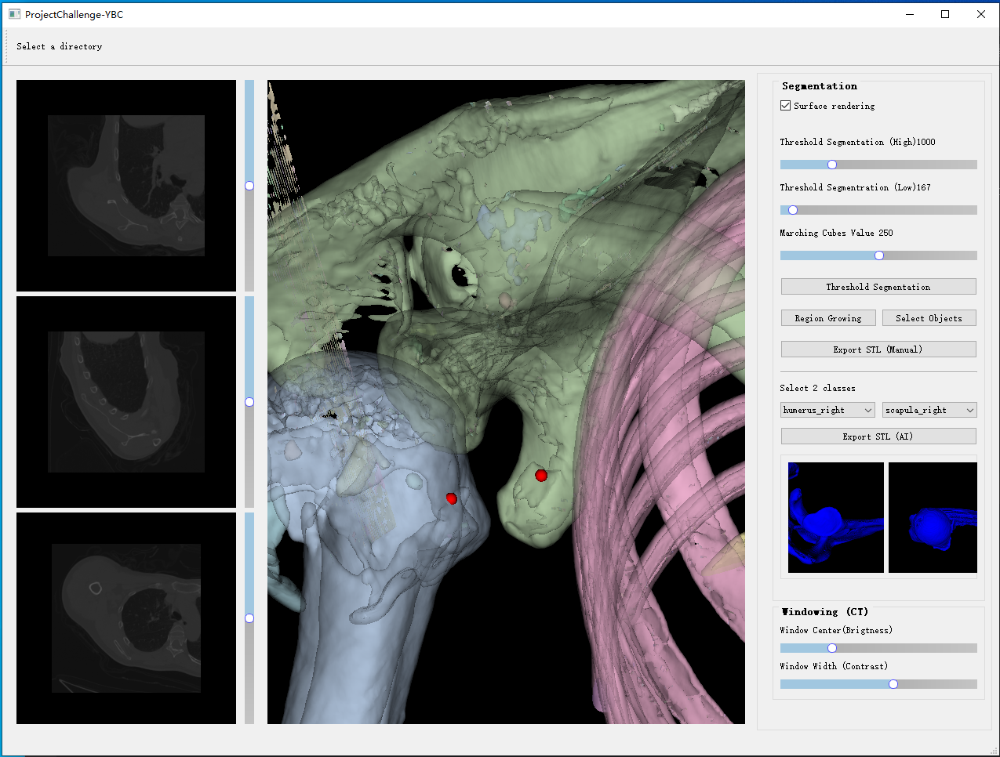

### Install
```
conda create -n vtk_seg_AI python==3.9.16
conda activate vtk_seg_AI
conda install pytorch==1.13.1 torchvision==0.14.1 torchaudio==0.13.1 pytorch-cuda=11.7 -c pytorch -c nvidia
pip install PyQt5==5.15.9
pip install vtk==9.3.0
pip install pandas
pip install TotalSegmentator
TotalSegmentator -i AnonymizedData -o segmentationAI --device gpu --roi_subset humerus_right scapula_right #test AI library
```

### Run
python main.py

### Brief introduction
Provide many in-built segmentation methods: Threshold segmentation, region growing, AI-driven segmentation. And some basic interactions: 3D select two target parts in region growing, slide viewer, UI enbaled by PyQt5. 




